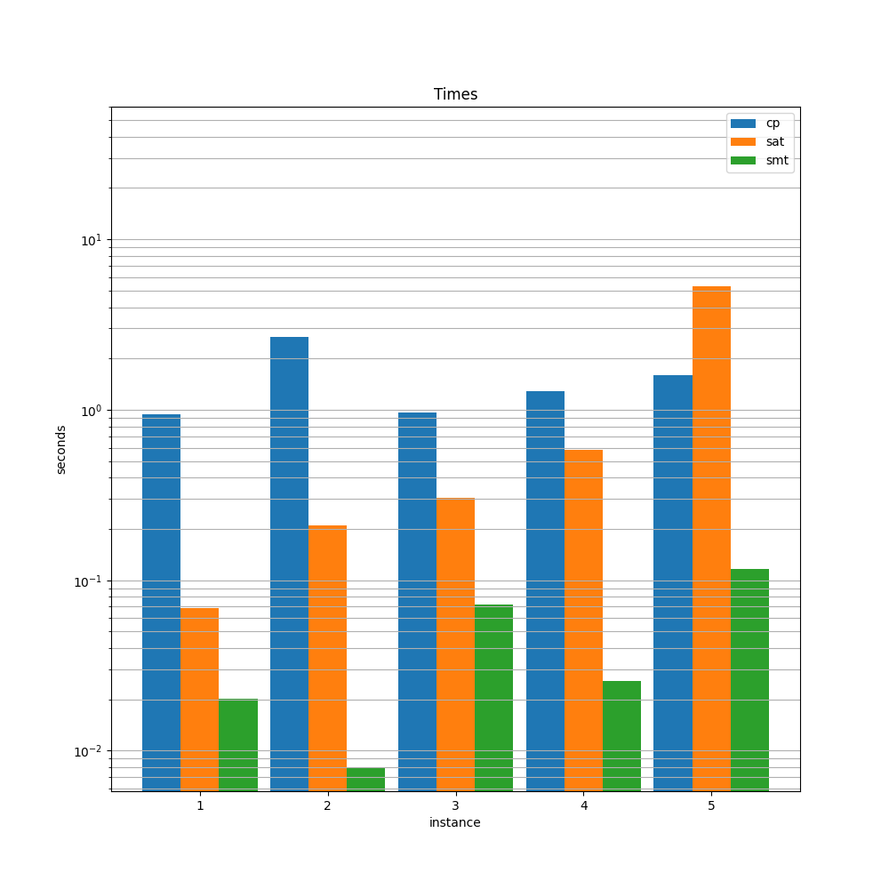

# Very large scale integration

The aim of this project is to model and solve a combinatorial decision problem with Constraint Programming (CP), propositional SATisfiability (SAT), and its extension to Satisfiability Modulo Theories (SMT). The problem is Very Large Scale Integration (VLSI),which refers to the trend of integrating circuits into silicon chips. Given a fixed-width plate and a list of rectangular circuits, one must decide how to place them on the plate so that the length of the final device is minimized. In order for the device to work properly, each circuit must be placed in a fixed orientation with respect to the others, therefore it cannot be rotated.



## Setup

### To run

```console
$ make setup
$ python very-large-scale-interaction.py
```

### To develop

```console
$ make dev
```